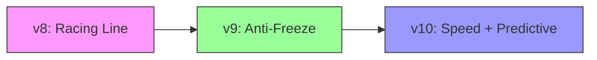

# AIbrain Ensemble - Podklady pro prezentaci
## Evoluce neuronové sítě pro autonomní řízení závodního vozu

---

# Slide 1: Úvod - Co je AIbrain Ensemble?

## Ensemble neuronová síť pro autonomní řízení

- **Účel:** Řízení virtuálního závodního vozu na trati
- **Architektura:** Dva propojené modely (Model A + Model B)
- **Učení:** Evoluční algoritmus s mutací a selekcí
- **Vstupy:** 9 senzorů vzdálenosti + rychlost + historie

```
┌─────────────────────────────────────────────────────────────┐
│                       SENZORY (9x)                          │
│   90°L  60°L  45°L  30°L  0°  30°R  45°R  60°R  90°R        │
│                  + rychlost + historie                      │
└─────────────────────────────────────────────────────────────┘
                              │
                              ▼
                   ┌──────────────────────┐
                   │      Model A         │
                   │   (Rozhodování)      │
                   │  59 → 32 → 4 neurony │
                   └──────────────────────┘
                              │
            ┌─────────────────┴─────────────────┐
            │                                   │
            ▼                                   ▼
   ┌─────────────────┐                ┌─────────────────────────┐
   │  Akce (4x):     │                │      Model B            │
   │  Plyn, Brzda,   │                │     (Predikce)          │
   │  Vlevo, Vpravo  │◄───korekce─────│  Vstup: senzory + akce  │
   └─────────────────┘                │  63 → 24 → 9 neuronů    │
                                      │  Výstup: pred. senzory  │
                                      └─────────────────────────┘
```

> **Sekvenční architektura:** Model B přijímá výstup z Model A jako součást 
> svého vstupu (`input_B = concat(input_A, action_A)`) a jeho predikce 
> korigují finální akce.

---

# Slide 2: Architektura - Model A (Rozhodovací síť)

## Dvouvrstvá neuronová síť pro generování akcí

| Parametr | Hodnota |
|----------|---------|
| **Vstupní vrstva** | 59 neuronů |
| **Skrytá vrstva** | 32 neuronů (tanh aktivace) |
| **Výstupní vrstva** | 4 neurony (sigmoid aktivace) |

### Výpočet vstupů:
```python
input_size_A = (sensors_per_frame + 1) * history_length + sensors_per_frame
# = (9 + 1) * 5 + 9 = 59 vstupů
```

### Složení vstupu:
1. **Historie senzorů** (5 framů × 10 hodnot = 50)
2. **Derivace senzorů** (změna oproti minulému framu = 9)

### Výstupy:
| Index | Akce | Bias (v9) |
|-------|------|-----------|
| 0 | Plyn | +0.7 |
| 1 | Brzda | -0.5 |
| 2 | Zatočit vlevo | 0 |
| 3 | Zatočit vpravo | 0 |

---

# Slide 3: Architektura - Model B (Predikční síť)

## Síť pro predikci budoucích hodnot senzorů

| Parametr | Hodnota |
|----------|---------|
| **Vstupní vrstva** | 63 neuronů (input_A + akce) |
| **Skrytá vrstva** | 24 neuronů (tanh aktivace) |
| **Výstupní vrstva** | 9 neuronů (predikované senzory) |

### Účel predikce:
- **Anticipace nebezpečí** - model předvídá budoucí hodnoty senzorů
- **Včasná reakce** - brzdění ještě před dosažením nebezpečné zóny
- **Korekce akcí** - úprava výstupu Model A na základě predikce

```python
# Pokud predikovaný přední senzor < práh nebezpečí
if predicted_front < 0.8:
    danger_level = 1.0 - (predicted_front / 0.8)
    final_action[1] += danger_level * 0.2  # Přidat brzdu
    final_action[0] -= danger_level * 0.1  # Ubrat plyn
```

---

# Slide 4: Práce se senzory

## 9 senzorů vzdálenosti od překážek

```
       [2]45°L    [3]30°L  [4]0°  [5]30°R    [6]45°R
         \           \      |      /           /
          \           \     |     /           /
    [1]60°L─\          \    |    /          /─[7]60°R
              \         \   |   /         /
    [0]90°L────◯────────────◯───────────────[8]90°R
                        VOZIDLO
```

### Využití senzorů pro detekci situace:
```python
def detect_situation(self, sensors):
    left_avg = (sensors[0] + sensors[2]) / 2   # 90°L + 45°L
    right_avg = (sensors[8] + sensors[6]) / 2  # 90°R + 45°R
    asymmetry = left_avg - right_avg
    
    if abs(asymmetry) < 0.8:
        return "straight"     # Rovinka
    elif asymmetry > 0:
        return "right_turn"   # Více prostoru vlevo → zatáčka doprava
    else:
        return "left_turn"    # Více prostoru vpravo → zatáčka doleva
```

---

# Slide 5: Racing Line - Optimální trajektorie

## Technika out-in-out pro maximální rychlost v zatáčkách

### Fáze průjezdu zatáčkou:
1. **Před zatáčkou (approaching)** - vnější okraj (wide entry)
2. **V zatáčce (apex)** - vnitřní okraj (0.8-1.5 dlaždice)
3. **Po zatáčce (exiting)** - vnější okraj (wide exit)

### Bonus systém:
| Vzdálenost od vnitřního okraje | Bonus |
|-------------------------------|-------|
| 0.8 - 1.5 dlaždice | **1.0** (ideální apex) |
| 0.5 - 0.8 nebo 1.5 - 2.5 dlaždice | 0.5 |
| Na rovince (centrováno) | 0.3 |

```python
# Příklad pro zatáčku doprava (vnitřní strana = VPRAVO)
if situation == "right_turn":
    if 0.8 <= right_90 <= 1.8:
        bonus = 1.0  # Ideální apex!
```

---

# Slide 6: Hodnocení (Fitness funkce)

## Klíčové komponenty skóre

```python
score = base_score + lap_bonus + racing_bonus + efficiency_bonus + speed_bonus - freeze_penalty
```

| Komponenta | Váha | Popis |
|------------|------|-------|
| **base_score** | distance × 5.0 | Základní odměna za ujetou vzdálenost |
| **lap_bonus** | 200.0 / kolo | Vysoká odměna za dokončení kola |
| **racing_bonus** | racing_line × 60.0 | Odměna za správnou trajektorii |
| **efficiency_bonus** | (10 - čas/kolo) × 25 | Bonus za rychlá kola |
| **speed_bonus** | avg_speed × 1.5 | Motivace k udržování rychlosti |
| **freeze_penalty** | low_speed × 2.0 | Penalizace za stání (v9+) |

### Důležité prahy:
- Reset skóre při `distance < 1.0` nebo poklesu vzdálenosti o 50%
- Efficiency bonus pouze při `time_per_lap < 10.0` sekund

---

# Slide 7: Evoluční algoritmus - Mutace

## Genetická evoluce vah neuronové sítě

### Mutační proces:
```python
def mutate(self):
    mutation_rate = 0.25  # v8, v9
    # mutation_rate = 0.15  # v10 (sníženo pro stabilitu)
    
    self.W1_A += np.random.randn(*self.W1_A.shape) * mutation_rate
    self.b1_A += np.random.randn(*self.b1_A.shape) * mutation_rate
    # ... obdobně pro všechny váhy a biasy
    
    self.NAME += "m"  # Označení mutace v názvu
```

### Selekce:
- Nejlepší jedinci přežívají
- Potomci vznikají mutací vah rodičů
- Náhodné změny umožňují evoluci

---

# Slide 8: Evoluce - Verze 8 (RACING LINE)

## AIbrain_Ensemble8 - Zaměření na trajektorii

### Hlavní vlastnosti:
- ✅ **Opravená detekce zatáček** (left/right bylo obrácené)
- ✅ **Graduální apex bonus** (0.2 - 1.0 bodů)
- ✅ **Dynamická detekce startu** (funguje na jakékoli mapě)
- ✅ **Historie situací** pro detekci fází zatáčky

### Bias hodnoty:
| Akce | Bias |
|------|------|
| Plyn | +0.5 |
| Brzda | -0.3 |

### Problém verze 8:
> ⚠️ **Auta občas "zamrzla"** - zastavila se a nepokračovala v jízdě

```python
# Slabší boost pro rozjezd
if self.speed < 30 and front_sensor > 0.8:
    final_action[0] = 1.0  # Plný plyn
```

---

# Slide 9: Evoluce - Verze 9 (ANTI-FREEZE) ⭐

## AIbrain_Ensemble9 - Referenční implementace

### Hlavní vylepšení oproti v8:
- ✅ **Silný anti-freeze mechanismus** - auta nikdy nezamrznou
- ✅ **Penalizace za stání** ve fitness funkci
- ✅ **Zjednodušená logika brzdění**
- ✅ **3-úrovňový systém nouzového rozjezdu**

### Anti-freeze systém:

| Level | Podmínka | Akce |
|-------|----------|------|
| **1** | speed < 100 + volno vpředu | Plyn ≥ 0.75, Brzda ≤ 0.15 |
| **2** | speed < 50 + relativně volno | Plyn ≥ 0.9, Brzda ≤ 0.1 |
| **3** | freeze_frames > 10 | Plný plyn + náhodné zatáčení |

### Bias hodnoty (agresivnější):
| Akce | Bias |
|------|------|
| Plyn | **+0.7** (zvýšeno) |
| Brzda | **-0.5** (sníženo) |

---

# Slide 10: Evoluce - Verze 10 (SPEED + PREDICTIVE)

## AIbrain_Ensemble10 - Nejnovější verze

### Hlavní vylepšení oproti v9:
- ✅ **Vyšší maximální rychlost** - agresivnější akcelerace
- ✅ **Prediktivní brzdění před zatáčkami**
- ✅ **Snížená mutační míra** (0.25 → 0.15) pro stabilnější evoluci
- ✅ **Kompatibilita s váhami z v9**

### Nové algoritmy:

#### Prediktivní brzdění:
```python
braking_distance_needed = self.speed / 150.0
if turn_approaching and front_sensor < braking_distance_needed:
    brake_intensity = min(0.8, (braking_distance - front) * 0.4)
    final_action[1] = max(final_action[1], brake_intensity)
```

#### Agresivní akcelerace na rovince:
```python
if situation == "straight" and front_sensor > 2.5:
    final_action[0] = max(final_action[0], 0.95)  # Skoro plný plyn
```

### Změny ve fitness:
- **speed_bonus** zvýšen: `avg_speed × 2.5` (z 1.5)
- **Bonus za vysokou rychlost**: +50 při speed > 300, +25 při speed > 200

### Bias hodnoty (nejagresivnější):
| Akce | Bias |
|------|------|
| Plyn | **+0.85** |
| Brzda | **-0.7** |

---

# Shrnutí evoluce



| Vlastnost | v8 | v9 | v10 |
|-----------|----|----|-----|
| Racing line | ✅ Komplexní | ✅ Zjednodušená | ✅ Zjednodušená |
| Anti-freeze | ❌ Slabý | ✅ **Silný** | ✅ Silný |
| Prediktivní brzdění | ❌ | ❌ | ✅ **Nové** |
| Agresivní akcelerace | ❌ | ⚡ Střední | ⚡⚡ **Vysoká** |
| Mutační míra | 0.25 | 0.25 | **0.15** |
| Bias plyn/brzda | 0.5/-0.3 | 0.7/-0.5 | **0.85/-0.7** |
